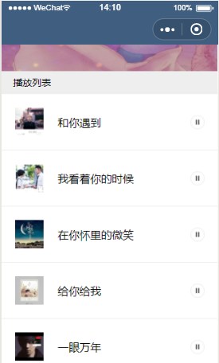

## 一、01init

#### 1-1 view设100%没用,必须给page先设置100%

#### 1-2 wx.switchTab跳转到tabbar页面

## 二、02swiper

```
<swiper>
	<swiper-item>
	 	'''
	</swiper-item>
</swiper>
```

## 三、03collect-storage

```js
//3-1 设一一个对象装载缓存
{
       "0":"false",
       "1":"true",
       "2":"false",
       "3":"true"
}
//3-2 有缓存设获取缓存,没有缓存则设置缓存
    var collection =wx.getStorageSync('collection');
     /* 有缓存,获取缓存 */
     if(collection){
        collected = collection[id];
        this.setData({
          isCollected:collected
        })
     }else{
       /*没有缓存,就设置缓存 */
       var collection = {};
       collection[id] = false;
       wx.setStorageSync('collection', collection)
       /* {"0":"false","1":"false"} */
     }
```

```
//3-3  设计点击事件
<image bind:tap="handleCollect" ...></image>
```

```js
handleCollect(){
    /* 获取缓存 */
    var collection= wx.getStorageSync('collection')
    var collected = !collection[this.data.id];
    collection[this.data.id] = collected;
    /* 更新缓存 */
    wx.setStorageSync('collection', collection)
    this.setData({
      isCollected:collected
    })
  }
```

## 四、showModal实现收藏

```js
handleCollect(){
    /* 获取缓存 */
    var collection= wx.getStorageSync('collection')
    var collected = !collection[this.data.id];
    collection[this.data.id] = collected;
    /* 更新缓存 */
    this.showModal(collected,collection)
 },
 showMoal(collected,collection){
     wx.showModal({
      title: '收藏',
      content: '收藏文章',
      success: (res) => {
        if (res.confirm) {
            //点击确定触发
          if (collected) {
            wx.setStorageSync('collection', collection)
            this.setData({
              isCollected: collected
            })
          }
        } else if (res.cancel) {
            //点击取消触发
          if (collected == false) {
            wx.setStorageSync('collection', collection)
            this.setData({
              isCollected: collected
            })
          }
        }
      }
    })
}
```

#### 4-1 分享

```js
wx.showActionSheet({
      itemList: [
        '分享到微信',
        '分享到朋友圈'
      ],
      itemColor: '#000000',
      success: (res) => {
        console.log(res.tapIndex)
      },
      fail: () => { },
      complete: () => { }
});
```


## 五、音乐播放

```js
5-1 点击事件
<image class="music" bind:tap="handleMusic"></image>
```

```js
5-2  实现音乐播放,暂停
var audio = wx.getBackgroundAudioManager()
handleMusic(){
    if(this.data.isPlay){
      audio.pause();
      this.setData({
        isPlay:false
      })
    }else{
      audio.title = this.data.item.music.title
      audio.src = this.data.item.music.url
      this.setData({
        isPlay:true
      })
    }
  }
```

```js
5-3 监听音乐播放  bottom-icon
audio.onPlay(()=>{
       this.setData({
         isPlay:true
       })
    })
    audio.onPause(()=>{
      this.setData({
        isPlay:false
      })
    })
```

```js
5-4 进入和退出一直
//app.js
//5-4-1 app.js  定义g_isPlay记录音乐播放的状态
App({
    onLaunch: function(options) {
        
    },
    globalData: {
        g_isPlay:false
    }
});
//5-4-2  在handleMusic事件中设置g_isPlay
handleMusic(){
    if(this.data.isPlay){
      ....
      app.globalData. g_isPlay = false
      console.log(app.globalData.g_isPlay)
    }else{
      ...
      app.globalData. g_isPlay = true;
      console.log(app.globalData.g_isPlay)
      
    }
  }
//5-4-3 在onLoad生命周期中监听
/* 让退入和进入音乐播放按钮一致 */
    if(app.globalData.g_isPlay){
      this.setData({
        isPlay:true
      })
    }else{
      this.setData({
        isPlay:false
      })
    }
```

```js
//5-4-5
1.在app.json  定义g_playId记录正在播放音乐的id
App({
    globalData: {
        g_isPlay:false,
        g_playId:""
    }
});
//2.设置g_playId
handleMusic(){
      ....
      app.globalData.g_playId = this.data.id;
      app.globalData. g_isPlay = true; 
    }
  }
  
//3.onLoad()函数中判断
  /* 让退入和进入音乐播放按钮一致 */
    if(app.globalData.g_isPlay && app.globalData.g_playId == id){
      this.setData({
        isPlay:true
      })
    }else{
      this.setData({
        isPlay:false
      })
    }
```

## 六、处理评分组件

```js
function formatStar(value) {
    if (value) {
        var value = value.substring(0, 1);
        var arr = []
        for (var i = 1; i <= 5; i++) {
            if (i <= value) {
                arr.push(1)
            } else {
                arr.push(0)
            }
        }
        return arr;
    }

}
module.exports = {
    formatStar: formatStar
}
```

## 七、scroll-view  x

```js
scroll-x="true"
<scroll-view></scroll-view>
```

## 八、previewImage

```js
wx.previewImage({
      current: url,
      urls:[]
});
```

## 九、网易云音乐播放

```js
1.跳转到music-play页面音乐开发播放
onLoad(){
    ....
    myaudio.title = name;
    myaudio.src = url;
    myaudio.coverImgUrl = poster;
}
2.执行点击事件,音乐可以暂时可以播放
handleClick(){
     if(this.data.isPlay){
       this.setData({
         isPlay:false
       })
       myaudio.pause()
     }else{
       this.setData({
         isPlay:true
       })
       myaudio.play()
     }
}
3.bottom-playIcon和音乐播放暂停一致
onLoad(){
    myaudio.onPlay(()=>{
      this.setData({
        isPlay:true
      })
   })
   myaudio.onPause(()=>{
     this.setData({
       isPlay:false
     })
   })
}
4.存在一个问题:跳转回music-detail播放的状态不会改变
解决:使用缓存去存储音乐播放的状态   1.点击事件中存储 2.onLoad
handleClick(){
    if(this.data.isPlay){
       this.setData({
         isPlay:false
       })
       myaudio.pause()
       wx.setStorageSync('playState', false)
     }else{
       this.setData({
         isPlay:true
       })
       myaudio.play()
       wx.setStorageSync('playState', true)
     }
}
onLoad(){
    ....//播放音乐的逻辑
    wx.setStorageSync('playState', true)
    
    myaudio.onPlay(()=>{
      this.setData({
        isPlay:true
      })
      wx.setStorageSync('playState', true)
   })
   myaudio.onPause(()=>{
     this.setData({
       isPlay:false
     })
     wx.setStorageSync('playState', false)
   })
}
5.在music-detail获取缓存 -->获取音乐播放的状态
onShow(){
    onShow() {
    var playState = wx.getStorageSync('playState');
    var playId = wx.getStorageSync('playId')
    if(playState!=null){
      this.setData({
        isPlay:playState
      })
    }
  }
}
```

```...
 <image src="{{isPlay?'/images/icons/play.png':'/images/icons/pause.png'}}" class="play-icon"></image>
```

> Tip:列表页面所有的状态都会是播放



```js
6.解决以上问题
方案:将正在播放的id回传,只有播放的id等于列表页的id就是播放的状态
6-1 music-play.js
onLoad(){
    ...
    wx.setStorageSync('playId',id)
}
6-2 music-detail.js 获取id
onShow(){
    var playId = wx.getStorageSync('playId')
    this.setData({
      playId
    })
}
6-3 music-detail.wxml
//只有音乐为播放状态同时playId等于正在播放音乐的id,才显示播放的状态
<image src="{{isPlay &&playId == item.id?...}}></image>
```

